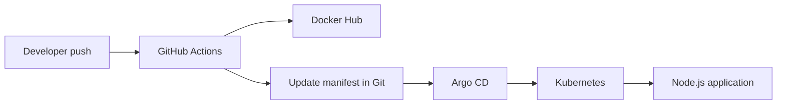

# GitOps CI/CD Pipeline with GitHub Actions and Argo CD

[](https://github.com/jerrysarpey7-spec/GITOPS-CICD-PIPELINE/actions/workflows/argo-action.yml)

A complete GitOps deployment pipeline for a Node.js application using GitHub Actions, Docker Hub, Kubernetes, Minikube, and Argo CD.

When application code is pushed to `main`, GitHub Actions builds and publishes a new Docker image, updates the Kubernetes deployment manifest with the immutable image tag, and commits that manifest change to Git. Argo CD continuously watches the repository and automatically synchronizes the desired state to Kubernetes.

> Minikube on EC2 is intended for learning and portfolio demonstrations. For production, use a managed Kubernetes service such as Amazon EKS, Google Kubernetes Engine, or Azure Kubernetes Service with TLS, private networking, least-privilege access, monitoring, and a production ingress controller.

## Architecture



## Pipeline Flow

1. A developer pushes application changes to the `main` branch.
2. GitHub Actions installs the Node.js dependencies and builds the application image.
3. Trivy scans the image before it is pushed to Docker Hub.
4. The image is tagged with the Git commit SHA and pushed to Docker Hub.
5. GitHub Actions updates the image tag in `manifest/deployment.yml` and commits the change.
6. Argo CD detects the Git change and synchronizes it to Kubernetes.
7. Kubernetes performs a rolling update and runs the new application version.

## Technologies

- GitHub Actions — continuous integration and image automation
- Docker and Docker Hub — container build and registry
- Kubernetes and Minikube — container orchestration
- Argo CD — GitOps continuous delivery
- AWS EC2 Ubuntu — demonstration host
- Node.js — sample application runtime

## Repository Structure

```text
GITOPS-CICD-PIPELINE/
├── .github/
│   └── workflows/
│       └── argo-action.yml
├── manifest/
│   ├── deployment.yml
│   └── service.yml
├── app.js
├── package.json
├── package-lock.json
├── Dockerfile
└── README.md
```

## Prerequisites

Before starting, you need:

- An AWS account and an Ubuntu EC2 instance (`t3.medium` recommended)
- An EC2 key pair
- A GitHub repository
- A Docker Hub account and repository
- Git installed locally
- Security-group access to SSH port `22` from your IP address

Do not expose the Argo CD API or Kubernetes NodePorts directly to the public internet. The instructions below use SSH tunneling for safer access.

## 1. Provision the EC2 Instance

Create an Ubuntu EC2 instance and allow inbound SSH only from your current public IP.

On your local machine, protect the private key and connect to the instance:

```bash
chmod 600 keypair.pem
ssh -i keypair.pem ubuntu@EC2_PUBLIC_IP
```

Update the operating system:

```bash
sudo apt update
sudo apt upgrade -y
```

## 2. Install Docker

```bash
sudo apt install -y docker.io
sudo systemctl enable --now docker
sudo usermod -aG docker "$USER"
```

Log out and reconnect so the Docker group membership takes effect:

```bash
exit
ssh -i keypair.pem ubuntu@EC2_PUBLIC_IP
```

Verify Docker:

```bash
docker run --rm hello-world
docker version
```

## 3. Install kubectl

```bash
sudo snap install kubectl --classic
kubectl version --client
```

## 4. Install and Start Minikube

```bash
curl -LO https://github.com/kubernetes/minikube/releases/latest/download/minikube-linux-amd64
sudo install minikube-linux-amd64 /usr/local/bin/minikube
rm minikube-linux-amd64

minikube start --driver=docker
kubectl get nodes
```

Optional: enable the Minikube ingress add-on:

```bash
minikube addons enable ingress
```

## 5. Clone the Repository

For a public repository:

```bash
git clone https://github.com/jerrysarpey7-spec/GITOPS-CICD-PIPELINE.git
cd GITOPS-CICD-PIPELINE
```

For a private repository, use SSH authentication or a fine-grained GitHub personal access token with access limited to this repository. A token is not required to clone a public repository.

## 6. Create the GitHub Actions Workflow

Create the workflow directory and file if they do not already exist:

```bash
mkdir -p .github/workflows
touch .github/workflows/argo-action.yml
```

The workflow should:

1. Check out the repository.
2. Install the Node.js dependencies.
3. Build the Docker image.
4. Tag the image with `${{ github.sha }}` instead of `latest`.
5. Scan the image with Trivy.
6. Push the image to Docker Hub.
7. Update the image field in `manifest/deployment.yml`.
8. Commit and push only the manifest change.

Configure the workflow to avoid starting another image build when its own manifest-only commit is pushed. This can be done with a `paths-ignore` rule for `manifest/**` or an equivalent job condition.

## 7. Configure Docker Hub

Create a Docker Hub repository, for example:

```text
jerrishpapa/my-app
```

Create a Docker Hub access token with read and write permissions. In the GitHub repository, go to:

**Settings → Secrets and variables → Actions → New repository secret**

Add these secrets:

| Secret | Value |
| --- | --- |
| `DOCKERHUB_USERNAME` | `jerrishpapa` |
| `DOCKERHUB_TOKEN` | Your Docker Hub access token |

Never commit tokens, passwords, `.env` files, or private keys to Git.

## 8. Install Argo CD

```bash
kubectl create namespace argocd
kubectl apply -n argocd -f https://raw.githubusercontent.com/argoproj/argo-cd/stable/manifests/install.yaml
kubectl wait --for=condition=Ready pods --all -n argocd --timeout=300s
kubectl get pods -n argocd
kubectl get svc -n argocd
```

## 9. Access the Argo CD UI Securely

On the EC2 instance, start the port-forward:

```bash
kubectl port-forward svc/argocd-server -n argocd 8080:443
```

Keep that terminal running. From a second terminal on your local computer, create an SSH tunnel:

```bash
ssh -i keypair.pem -L 8080:localhost:8080 ubuntu@EC2_PUBLIC_IP
```

Open the following URL locally:

```text
https://localhost:8080
```

Your browser may display a warning because the default Argo CD certificate is self-signed.

Get the initial administrator password from the EC2 instance:

```bash
kubectl get secret argocd-initial-admin-secret \
  -n argocd \
  -o jsonpath="{.data.password}" | base64 --decode
echo
```

Log in with:

- Username: `admin`
- Password: the decoded initial password

Change the initial password after the first login.

## 10. Install the Argo CD CLI

On the EC2 instance:

```bash
curl -sSL -o argocd https://github.com/argoproj/argo-cd/releases/latest/download/argocd-linux-amd64
chmod +x argocd
sudo install argocd /usr/local/bin/argocd
rm argocd
argocd version --client
```

With the port-forward running, you can log in from the EC2 instance:

```bash
argocd login localhost:8080 --username admin --insecure
```

## 11. Connect the Git Repository

Public repositories can normally be used directly when creating the Argo CD application.

For a private repository, open the Argo CD UI and go to:

**Settings → Repositories → Connect Repo**

Configure:

- Connection method: HTTPS or SSH
- Repository type: Git
- Repository URL: your GitHub repository URL
- Project: `default`

Use a GitHub deploy key or fine-grained read-only credential for private repository access. Do not give Argo CD unnecessary write access.

## 12. Create the Application Namespace

Application workloads should not run in the `argocd` namespace. Create a separate namespace:

```bash
kubectl create namespace demo
```

The manifests do not need hard-coded namespaces when the Argo CD application is configured to deploy them to `demo`.

## 13. Create the Argo CD Application

In the Argo CD UI, select **New App** and use:

| Field | Value |
| --- | --- |
| Application name | `argocd-github-actions` |
| Project | `default` |
| Sync policy | `Automatic` |
| Prune resources | Enabled |
| Self-heal | Enabled |
| Repository URL | Your GitHub repository URL |
| Revision | `main` |
| Path | `manifest` |
| Cluster URL | `https://kubernetes.default.svc` |
| Namespace | `demo` |

Enable **Auto-Create Namespace** if the `demo` namespace was not created manually.

The equivalent CLI command is:

```bash
argocd app create argocd-github-actions \
  --repo https://github.com/jerrysarpey7-spec/GITOPS-CICD-PIPELINE.git \
  --revision main \
  --path manifest \
  --dest-server https://kubernetes.default.svc \
  --dest-namespace demo \
  --sync-policy automated \
  --auto-prune \
  --self-heal \
  --sync-option CreateNamespace=true
```

## 14. Verify the Deployment

Push an application change to `main`, then monitor GitHub Actions. After the workflow updates the deployment manifest, Argo CD should automatically synchronize it.

Verify the application resources:

```bash
argocd app get argocd-github-actions
kubectl get deployments,pods,services -n demo
kubectl rollout status deployment/node-app-deployment -n demo
```

Confirm that the running deployment uses the expected immutable image tag:

```bash
kubectl get deployment node-app-deployment -n demo \
  -o jsonpath="{.spec.template.spec.containers[0].image}"
echo
```

## 15. Access the Node.js Application

On the EC2 instance, forward the Kubernetes service to a local EC2 port:

```bash
kubectl port-forward svc/my-service -n demo 3000:80
```

From a second terminal on your local computer, create an SSH tunnel:

```bash
ssh -i keypair.pem -L 3000:localhost:3000 ubuntu@EC2_PUBLIC_IP
```

Open:

```text
http://localhost:3000/hello
```

The application listens on port `3000`, while the Kubernetes service exposes it internally on port `80`.

## 16. Troubleshooting

Check cluster and application status:

```bash
minikube status
kubectl get nodes
kubectl get all -n demo
kubectl get events -n demo --sort-by=.metadata.creationTimestamp
```

Inspect a failed pod:

```bash
kubectl describe pod POD_NAME -n demo
kubectl logs POD_NAME -n demo
```

Inspect Argo CD:

```bash
argocd app get argocd-github-actions
argocd app history argocd-github-actions
kubectl logs -n argocd statefulset/argocd-application-controller
```

If Argo CD does not detect a new commit, refresh the application:

```bash
argocd app get argocd-github-actions --refresh
```

## 17. Security Recommendations

- Restrict EC2 SSH access to your IP address.
- Use SSH tunnels instead of publicly exposing Argo CD or Kubernetes NodePorts.
- Use immutable image tags such as the Git commit SHA.
- Store credentials only in GitHub Actions secrets or an external secret manager.
- Give GitHub Actions, Argo CD, and Docker Hub tokens the minimum permissions required.
- Use branch protection and pull-request reviews for production manifest changes.
- Pin third-party GitHub Actions to immutable commit SHAs.
- Add dependency, container, and manifest scanning to the CI workflow.
- Rotate the initial Argo CD administrator password and disable the account when SSO is configured.

## 18. Cleanup

Delete the application and Argo CD resources:

```bash
argocd app delete argocd-github-actions --cascade
kubectl delete namespace demo
kubectl delete namespace argocd
```

Stop and delete Minikube:

```bash
minikube stop
minikube delete --all
```

Finally, terminate the EC2 instance and remove unused EBS volumes, Elastic IP addresses, snapshots, and other billable AWS resources.

## Production Improvements

For a production-ready implementation:

- Replace Minikube with Amazon EKS, GKE, or AKS.
- Use a managed load balancer or ingress with DNS and TLS.
- Store images in a private registry such as Amazon ECR.
- Use workload identity or IAM roles instead of long-lived cloud credentials.
- Add automated tests, linting, Trivy scanning, and policy validation.
- Use image signing and verification.
- Add centralized logging, metrics, alerting, and audit trails.
- Use separate repositories or controlled promotion between environments.
- Deploy Argo CD in a highly available configuration with SSO and RBAC.

## License

This project is available for educational and portfolio use. Add a license file if you intend to distribute or reuse it publicly.
